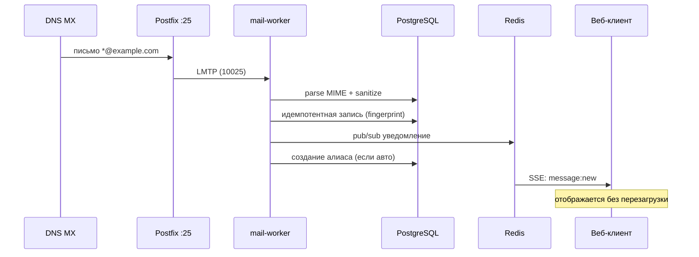

# CatchBox — современный почтовый сервис с catch-all

> 📬 **Производительный self-hosted почтовый сервер** с веб-клиентом, поддержкой тысяч алиасов, поиском по письмам и отправкой через внешние транспортеры (Resend/Postmark/SES или свой SMTP).

<div align="center">

🚀 Полная готовность • 🔒 Без утечек данных • ⚡ Realtime обновления • ✉️ DKIM-подпись • 💎 Красивый интерфейс

</div>

---

## Особенности

| Категория | Что есть |
|-----------|----------|
| **Приём** | Ловит всё на `*@example.com` → автоматически создаёт алиасы для каждого получателя |
| **Отправка** | Resend / Postmark / SES / ваш SMTP + автоматическая DKIM-подпись (RSA-SHA256) |
| **Безопасность** | Argon2id пароли, CSRF, rate limiting, 2FA (TOTP), санитизация HTML, блокировка трекеров |
| **Удобство** | Поиск (PostgreSQL FTS), правила маршрутизации, архивация, метки, избранное |
| **Realtime** | SSE-обновления UI при получении писем без перезагрузки |
| **Инфраструктура** | Docker Compose, резервное копирование, TLS Let's Encrypt, миграции PostgreSQL |

### Быстрый старт (10 минут)

```bash
# 1. Клон и установка
git clone https://github.com/dakosa/catchbox.git
cd catchbox
pnpm install

# 2. Поднять зависимости (Docker)
docker compose -f infrastructure/docker/docker-compose.dev.yml up -d postgres redis

# 3. Настройка БД
cp .env.example .env                # редактируй значения
pnpm db:migrate                     # применяет миграции
pnpm owner:create                   # создаёт владельца + recovery key

# 4. Запуск сервисов
pnpm --filter @catchbox/mail-worker dev &   # LMTP приём
pnpm --filter @catchbox/api dev &           # API backend
pnpm --filter @catchbox/web dev             # Web UI на http://localhost:5173
```

Откройте **http://localhost:5173** и войдите под созданным аккаунтом.

---

## Как это работает



### Технологии

- **Backend**: Fastify (API), BullMQ (очередь), Drizzle (ORM), PostgreSQL+tsvector
- **Ingest**: LMTP (smtp-server), postal-mime (парсинг), sanitize-html (HTML)
- **Outbound**: nodemailer + DKIM-подпись (relaxed/relaxed rsa-sha256)
- **Frontend**: Vite + React + TanStack Query + Radix UI
- **Infra**: Docker Compose (Postgres, Redis, Postfix, Nginx/Caddy)

---

## Производство: развёртывание

### Вариант A: Docker Compose (рекомендуется)

```bash
# 1. Подготовка
cp .env.example .env
nano .env                 # задай POSTGRES_PASSWORD, S3_*, RESEND_API_KEY и т.д.

# 2. Генерация DKIM
openssl genpkey -algorithm RSA -pkeyopt rsa_keygen_bits:2048 -out infrastructure/dkim/catchbox.private.key

# 3. Старт
cd infrastructure/docker
docker compose build
docker compose up -d --build

# 4. Первый администратор
docker compose exec api node --import tsx scripts/create-owner.ts
# скопируй recovery key из вывода!
```

### Вариант B: Native (на хосте)

```bash
# Установи сервисы
sudo apt-get install postgresql redis-server postfix mailutils clamav-freshclam

# Настрой Postfix (catch-all → LMTP :10025)
cat > /etc/postfix/main.cf <<'EOF'
...
virtual_mailbox_domains = example.com
virtual_transport = lmtp:inet:127.0.0.1:10025
...
EOF

# Запусти worker/api в фоне
pnpm --filter @catchbox/mail-worker dev &
pnpm --filter @catchbox/api dev &
pnpm --filter @catchbox/web build && npm i -g serve && serve dist -p 5173
```

### DNS (Cloudflare/Route53)

```text
# MX
MX  @     10 mail.example.com.

# A
A   mail  YOUR_PUBLIC_IP

# SPF
TXT @ "v=spf1 mx ip4:YOUR_IP ~all"

# DKIM (кворум из public ключа из файла catchbox.public.key)
TXT catchbox._domainkey "v=DKIM1; k=rsa; p=<BASE64>"

# DMARC
TXT _dmarc "v=DMARC1; p=quarantine; rua=mailto:dmarc@example.com; fo=1"

# PTR/rDNS у хостера: IP → mail.example.com
```

---

## Тесты и верификация

```bash
# Все пакеты
pnpm -r typecheck      # строгий TypeScript (noEmit)
pnpm -r test           # vitest (unit + integration)
pnpm --filter @catchbox/web test:e2e   # Playwright e2e tests

# Проверка внешних эндпоинтов
curl https://mail.example.com/api/health
```

---

## Резервное копирование

```bash
# Полный бэкап
./infrastructure/backup.sh /backups/2026-08-07
ls /backups/2026-08-07/*   # .sql, .tar.gz, dkim/

# Восстановление
./infrastructure/restore.sh /backups/2026-08-07
```

---

## Частые вопросы (FAQ)

**Q: Почему мой почтовый сервер не может отправлять?**  
A: AWS/Linode/etc. блокируют исходящий порт 25. Решения:
- Отправь заявку провайдеру на снятие лимита;
- Или включи внешний транспортер в `.env`: `MAIL_TRANSPORT=resend`, задай `RESEND_API_KEY`.

**Q: Где настроить DKIM?**  
A: Сгенерируй ключ (`openssl ...`) → положи в `infrastructure/dkim/`. Для внешнего транспорта просто настрой свой DKIM в DNS (в проекте реализована отправка через postmark/SES/resend).

**Q: Как обновить пароль администратора?**  
A: В интерфейсе → Настройки → Безопасность → Изменить пароль (или_recovery_key_ если забыл).

**Q: Можно ли использовать вместо локального SMTP свой Postfix?**  
A: Да, настрой `SELF_HOSTED_SMTP_HOST=` и убедись, что Port 25 открыт извне.

---

## Автор и поддержка

Проект открыт для PRs и issue. Если нашли баг — опишите шаги воспроизведения. Любые улучшения приветствуются.

<p align="center">
  <sub>Сделано с любовью к производительности и приватности.</sub>
</p>
