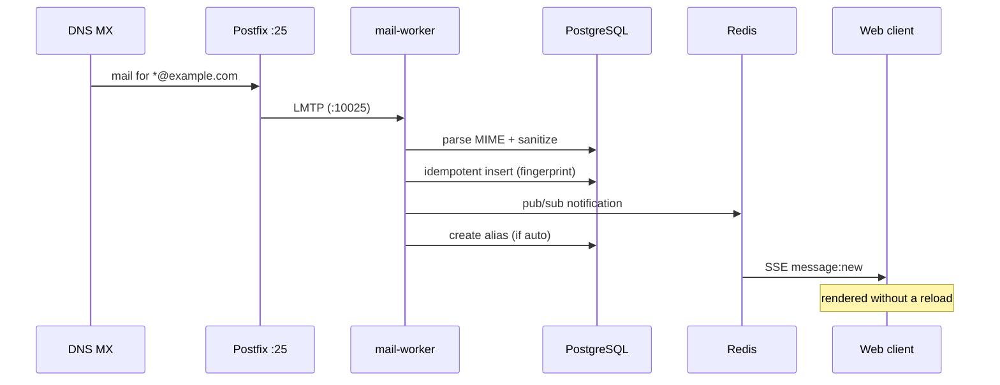

<div align="center">

# CatchBox

**Every address on your domain, one box.**

A self-hosted, catch-all mail server with a realtime web client, unlimited auto-created aliases, full-text search and DKIM-signed outbound delivery via Resend, Postmark, SES or your own SMTP.

[Website](https://quit.mom/catchbox/) · [Quick start](#quick-start) · [Production deployment](#production-deployment) · [How it works](#how-it-works) · [Contributing](#contributing)


🚀 Production-ready · 🔒 Private by design · ⚡ Realtime UI · ✉️ DKIM out of the box · 💎 Clean interface

</div>

---

## Why CatchBox?

Point an MX record at your server and **everything** sent to `*@yourdomain.com` lands in one inbox — `signup@`, `invoice-8842@`, even the typo of your name. A new alias is created automatically for every recipient, so no message ever bounces and no third party ever sees your mail.

| | |
|---|---|
| **Receive** | Catch-all on `*@yourdomain.com` with automatic alias creation per recipient |
| **Send** | Resend / Postmark / Amazon SES / your own SMTP, with automatic DKIM signing (RSA-SHA256) |
| **Security** | Argon2id password hashing, TOTP 2FA, CSRF protection, rate limiting, HTML sanitization, tracker blocking |
| **Organize** | Full-text search (PostgreSQL `tsvector`), routing rules, labels, archive, starred |
| **Realtime** | Server-sent events push new mail to the UI — no refresh, no polling |
| **Infra** | Docker Compose, Let's Encrypt TLS, automated backups, clean PostgreSQL migrations |

---

## Quick start

> ~10 minutes from clone to first mail. Requires Node 20+, pnpm 9 and Docker.

```bash
# 1. Clone & install
git clone https://github.com/wkzo/catchbox.git
cd catchbox
pnpm install

# 2. Start dependencies (Docker)
docker compose -f infrastructure/docker/docker-compose.dev.yml up -d postgres redis

# 3. Configure the database
cp .env.example .env             # edit values
pnpm db:migrate                  # apply migrations
pnpm owner:create                # creates the owner account + prints a recovery key

# 4. Run the services
pnpm --filter @catchbox/mail-worker dev &   # LMTP ingest (:10025)
pnpm --filter @catchbox/api dev &           # API backend
pnpm --filter @catchbox/web dev             # web UI → http://localhost:5173
```

Open **http://localhost:5173** and sign in with the account you just created.

---

## How it works



### Stack

- **API** — Fastify, BullMQ, Drizzle ORM, PostgreSQL + `tsvector`
- **Ingest** — LMTP (`smtp-server`), `postal-mime`, `sanitize-html`
- **Outbound** — Nodemailer with DKIM (relaxed/relaxed, rsa-sha256)
- **Frontend** — Vite + React, TanStack Query, Radix UI
- **Infra** — Docker Compose (Postgres, Redis, Postfix, Nginx/Caddy)

### Repository layout

```text
apps/
  api/          Fastify API backend (auth, mail, aliases, search)
  mail-worker/  LMTP ingest worker (parse, sanitize, store, notify)
  web/          React web client (Vite, Radix UI, SSE)
packages/
  db/           Drizzle schema + migrations
  store/        shared state/stores
  types/        shared TypeScript types
  config/       shared eslint/ts config
infrastructure/
  docker/       compose files, Dockerfiles, Caddy/Nginx config
  postfix/      reference Postfix configuration
  dkim/         DKIM key material (generated locally)
  dns/          reference DNS records
  backup.sh     full backup (SQL + uploads + DKIM)
  restore.sh    restore from backup
```

---

## Production deployment

### Option A — Docker Compose (recommended)

```bash
# 1. Configure
cp .env.example .env
nano .env                  # POSTGRES_PASSWORD, S3_*, RESEND_API_KEY, ...

# 2. Generate a DKIM keypair
openssl genpkey -algorithm RSA -pkeyopt rsa_keygen_bits:2048 \
  -out infrastructure/dkim/catchbox.private.key

# 3. Build & start
cd infrastructure/docker
docker compose build
docker compose up -d --build

# 4. Create the first admin
docker compose exec api node --import tsx scripts/create-owner.ts
# copy the recovery key from the output!
```

### Option B — Native (on the host)

```bash
sudo apt-get install postgresql redis-server postfix mailutils

# Postfix: catch-all → LMTP :10025
#   virtual_mailbox_domains = example.com
#   virtual_transport = lmtp:inet:127.0.0.1:10025

pnpm --filter @catchbox/mail-worker dev &
pnpm --filter @catchbox/api dev &
pnpm --filter @catchbox/web build && npx serve dist -p 5173
```

### DNS records

See [`infrastructure/dns/records.md`](infrastructure/dns/records.md) for the full reference.

| Type | Name | Value | Purpose |
|------|------|-------|---------|
| `MX` | `@` | `10 mail.example.com.` | inbound mail |
| `A` | `mail` | `YOUR_PUBLIC_IP` | edge host |
| `TXT` | `@` | `v=spf1 mx ip4:YOUR_IP ~all` | SPF |
| `TXT` | `catchbox._domainkey` | `v=DKIM1; k=rsa; p=<BASE64>` | DKIM (public key) |
| `TXT` | `_dmarc` | `v=DMARC1; p=quarantine; rua=mailto:dmarc@example.com; fo=1` | DMARC |
| `PTR` | — | `IP → mail.example.com` | reverse DNS (set at the hoster) |

---

## Testing & verification

```bash
pnpm -r typecheck                          # strict TypeScript (noEmit)
pnpm -r test                               # vitest (unit + integration)
pnpm --filter @catchbox/web test:e2e       # Playwright end-to-end

curl https://mail.example.com/api/health   # external health check
```

## Backups

```bash
# full backup (SQL + uploads + DKIM keys)
./infrastructure/backup.sh /backups/2026-08-07

# restore
./infrastructure/restore.sh /backups/2026-08-07
```

---

## FAQ

**Outbound mail is not being delivered — why?**
Many providers (AWS, Linode, …) block port 25 by default. Either request the limit to be lifted, or switch to an external transporter in `.env`: `MAIL_TRANSPORT=resend` + `RESEND_API_KEY`.

**Where do I configure DKIM?**
Generate a keypair with `openssl` and place it in `infrastructure/dkim/`. When using an external transporter, configure DKIM on that provider's side instead.

**How do I change the admin password?**
In the UI: Settings → Security → Change password (or use the recovery key if you forgot it).

**Can I use my own Postfix instead of the bundled one?**
Yes — set `SELF_HOSTED_SMTP_HOST=` and make sure port 25 is reachable from the internet.

---

## Contributing

Issues and pull requests are welcome. For bugs, include reproduction steps. For anything non-trivial, open an issue first so we can align on the approach.

## License

[MIT](LICENSE) — made with love for performance and privacy.
